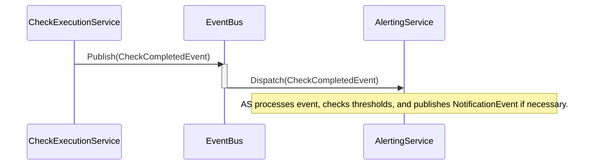
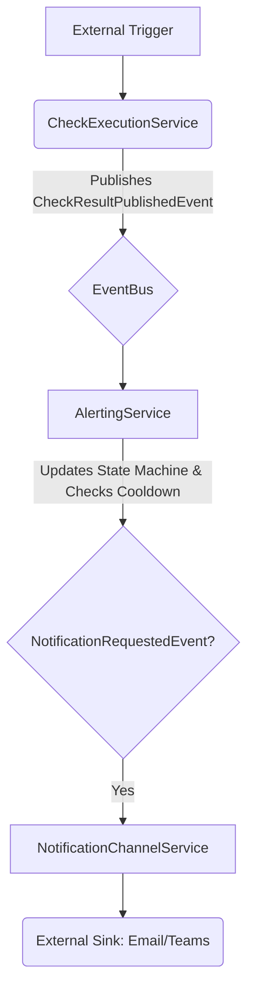

# Architecture Recommendations for LiveMonitor System

This document summarizes architectural findings from analyzing `ConnectionManager`, `CheckExecutionService`, and `AlertingService`. The primary goal of these recommendations is to improve modularity, robustness, scalability, and maintainability by adopting modern C# patterns.

## 1. Core Architectural Pattern: Event-Driven Architecture (EDA)
The most significant improvement will be decoupling the services using a centralized **Event Bus** or **Mediator Pattern**. Currently, `CheckExecutionService` directly invokes methods on `AlertingService`, creating tight coupling.

**Recommendation:** Introduce an `IEventBus` interface and implement it as a singleton service. Services should publish domain events (e.g., `CheckCompletedEvent`, `ConnectionUpdatedEvent`) instead of calling other services directly.

**Proposed Flow Diagram (Mermaid):**

## 2. Component-Specific Improvements

### A. `Data/ConnectionManager` (Task 1 Analysis)
**Findings:** The class uses synchronous I/O (`File.ReadAllText`, `File.WriteAllText`) within methods that manage state which should ideally be asynchronous to prevent blocking the calling thread pool, especially in a modern async application context. Locking mechanisms are present but need careful management when transitioning to full async operations.
**Recommendation:**
1.  **Async I/O:** Refactor all file read/write operations (`LoadConnections`, `SaveConnections`) to use their asynchronous counterparts (e.g., `File.ReadAllTextAsync`, `await File.WriteAllTextAsync`).
2.  **Interface Segregation:** Consider separating the *persistence* logic from the *business logic*. The service should interact with an `IConnectionRepository` interface, which handles async I/O details.
3.  **Thread Safety:** While locks are used, ensuring that all state modifications happen within a single, well-defined asynchronous transaction block is crucial.

### B. `Data/CheckExecutionService` (Task 2 Analysis)
**Findings:** The service correctly uses throttling (`SemaphoreSlim`) and async patterns for database interaction (`await cmd.ExecuteReaderAsync`). However, its dependency on directly invoking `OnCheckCompleted?.Invoke(result)` creates a direct coupling point that should be mediated by the Event Bus.
**Recommendation:**
1.  **Event Publishing:** Instead of invoking `OnCheckCompleted`, the service must publish a `CheckResultPublishedEvent` containing the result data to the Event Bus. This decouples it from knowing *who* is listening (e.g., AlertingService, LoggingService).
2.  **Resource Management:** Ensure that all disposable resources (`SqlConnection`, `SemaphoreSlim`) are correctly disposed of within `finally` blocks or using `using` statements, especially when handling exceptions during execution.

### C. `Data/AlertingService` (Task 5 Analysis)
**Findings:** The service manages complex state: cooldown tracking (`_lastAlertTime`), acknowledged IDs (`_acknowledgedIds`), and the queue of notifications (`_notifications`). This logic is brittle; adding new alert types or changing cooldown rules requires modifying core methods.
**Recommendation:**
1.  **State Machine Pattern:** Implement a dedicated **Alert State Machine**. The lifecycle of an alert (e.g., `Discovered` -> `Warning` -> `Critical` -> `Acknowledged` -> `Resolved`) should be managed by this state machine, rather than relying on manual checks against timestamps and sets.
2.  **Event Consumption:** This service should *only* subscribe to the `CheckCompletedEvent` (via the Event Bus). Upon receiving an event, it calculates if a new alert condition is met, updates its internal State Machine, and then publishes a `NotificationRequestedEvent` if necessary.

## 3. Cross-Cutting Concerns & Next Steps
**Cross-Cutting Concern:** **Logging/Tracing**. While logging exists, implementing structured logging (e.g., using Serilog or NLog) across all services would provide better observability for debugging complex asynchronous flows.

**Overall Architectural Flow Diagram:**

**Conclusion:** The system is functionally sound but architecturally coupled. Adopting an Event Bus pattern, combined with a State Machine for alert management and full async refactoring, will result in a highly scalable and maintainable monitoring solution.