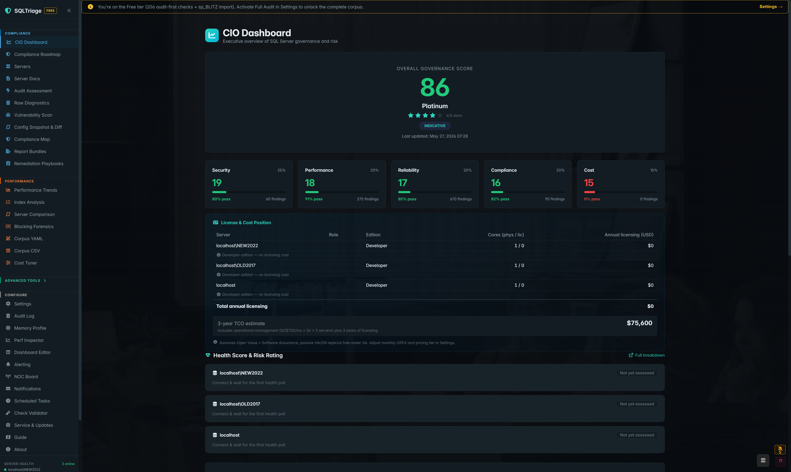
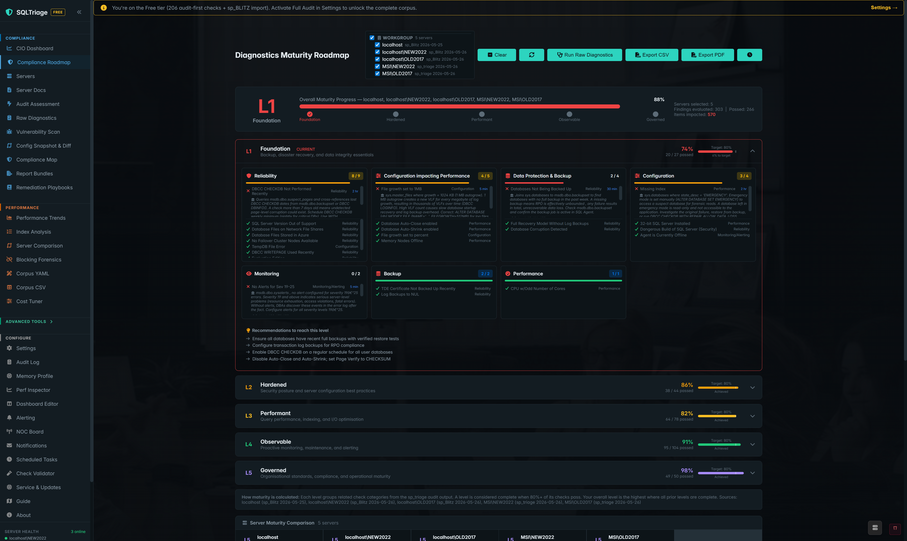
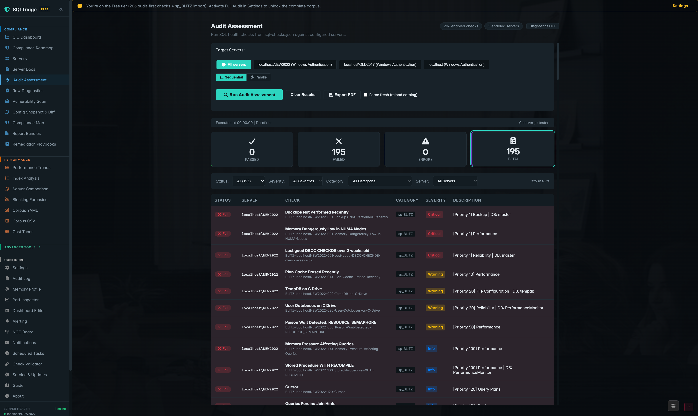
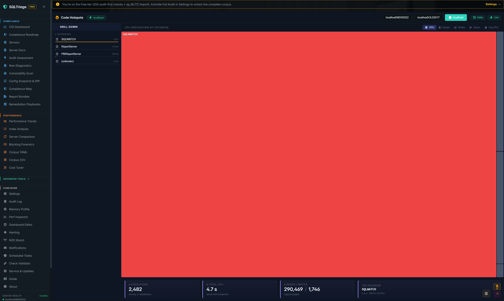
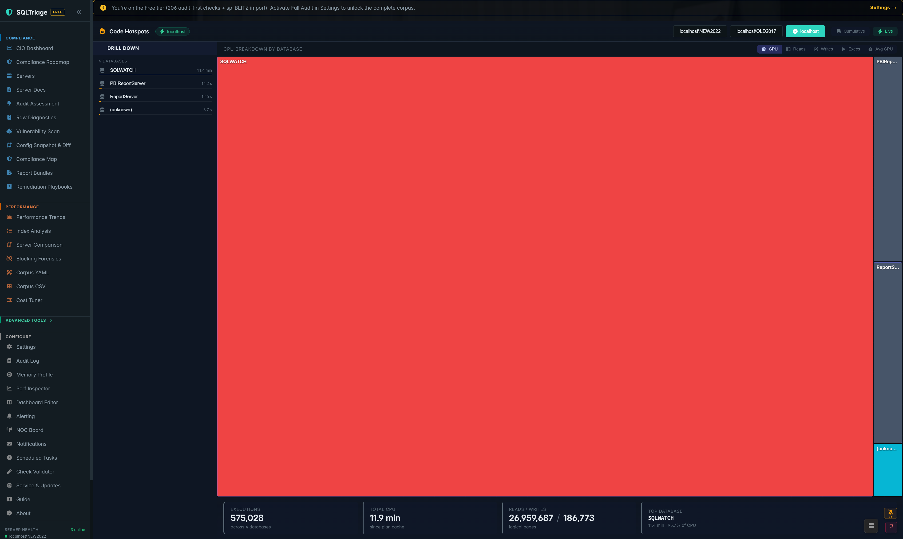
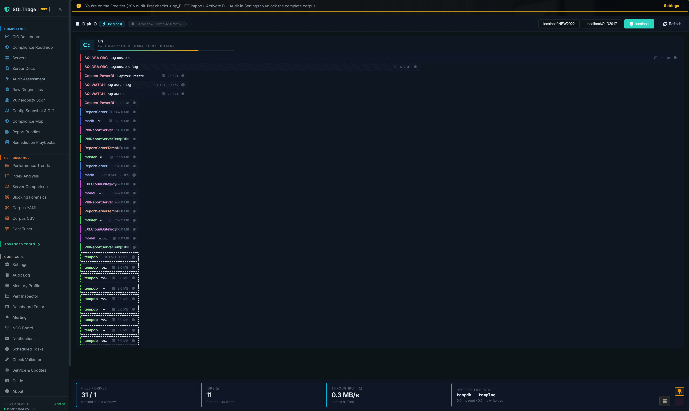
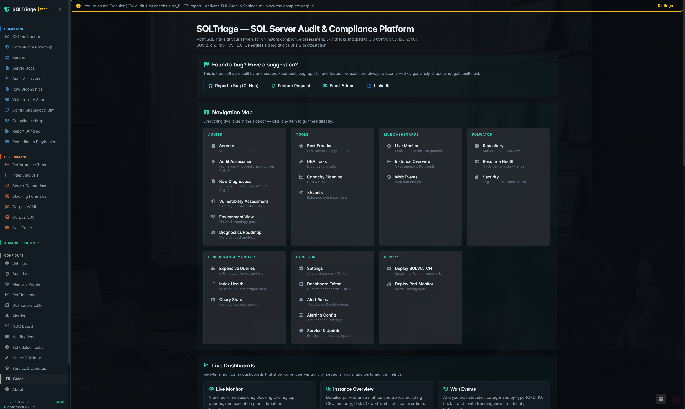

# SQLTriage

**The audit your CIO can actually defend.** Free, open-source, agentless SQL Server audit and compliance assessment — 600+ checks mapped to NIST SP 800-53, CIS Benchmarks, DISA STIG, ISO 27001, SOC 2, PCI-DSS, HIPAA.

The open alternative to Microsoft SQL Vulnerability Assessment — deeper coverage, every finding cited, every control traceable.

**[Download for Windows →](https://github.com/SQLAdrian/SQLTriage/releases)** · **[Live docs →](https://sqladrian.github.io/SQLTriage/)** · **[Security whitepaper →](https://sqladrian.github.io/SQLTriage/security)**

---

## What you get in 60 seconds

A board-ready governance score (Bronze → Silver → Gold → Platinum), a 5-category breakdown, and licensing-cost visibility — generated from real DMV reads on real servers, no agents, no install on the target.

---

## Audit-first by design

| Compliance Roadmap (Full tier) | Audit Assessment (Free tier) |
|---|---|
|  |  |
| Maturity roadmap mapping every finding to the framework controls auditors care about. Per-server progress tracking + multi-server comparison strip. | 195 sp_BLITZ findings imported and grouped in a single grid with priority/category badges. Free tier — no key, no signup. |

**Free tier** ships ~111 audit-first checks + the full sp_BLITZ integration. Use it indefinitely.

**Full tier** unlocks the complete ~700-check audit corpus, the maturity roadmap with per-framework gap analysis, governance scoring, build catalogue, and SQL licensing-cost estimator. [Activation guide →](https://sqladrian.github.io/SQLTriage/ACTIVATION)

---

## What makes it different — live monitoring that earns its keep

The audit is the headline. While you wait, two SentryOne-replacement surfaces give you the operational visibility most teams pay $$$ for:

### Code Hotspots — "what changed in the last 5 minutes"

| Delta view (since last snapshot) | Cumulative view (since plan cache) |
|---|---|
|  |  |
| Drill-down treemap (DB → object → statement) of `sys.dm_exec_query_stats`. Background snapshot loop (5-min interval, 24h retention, encrypted SQLite cache) gives you "what just got busy" without waiting for the plan cache to clear. | Same surface in cumulative mode for the long-tail "what's been hot for days" view. Toggle in the toolbar; both modes share the same drill and treemap rendering. |

### Disk IO — drive-lane view, real deltas, not month-old totals

Samples `sys.dm_io_virtual_file_stats` twice and shows the delta — current IO pressure, not since-startup cumulatives. Drive lanes group files per physical drive; HSL hue groups files by database; log files get diagonal striping; tempdb gets dashed outlines; live IOPS get a pulse animation on the heat dot. Hottest file + stalls surfaced as numbers below.

---

## The whole feature surface

Audit Assessment · Compliance Roadmap · CIO Dashboard · Compliance Map · Code Hotspots · Disk IO · Live Sessions · Wait Stats · Query Plan viewer · Server Health · Server Comparison · Index Analysis · Blocking Forensics · Memory Profile · Scheduled Tasks · Alerting · Audit Log · Report Bundles · Remediation Playbooks · and more.

---

## How it compares

| Capability | SQLTriage | sp_BLITZ | MS Vulnerability Assessment | SolarWinds DPA / Redgate |
|---|---|---|---|---|
| Cost | Free (GPL v3) | Free | Free (SSMS only) | $$$ per server |
| Agentless | ✅ | ✅ | ✅ | ❌ |
| Audit-grade checks | **~700** | ~150 | ~100 | — |
| Framework mapping (NIST / CIS / STIG / ISO / SOC 2 / PCI / HIPAA) | ✅ | ❌ | partial | ❌ |
| Maturity scoring (Bronze → Platinum) | ✅ | ❌ | ❌ | ❌ |
| Cited evidence per finding | ✅ | partial | ❌ | ❌ |
| Code hotspot delta (last-5-min view) | ✅ | ❌ | ❌ | ✅ |
| Drive-lane disk IO view | ✅ | ❌ | ❌ | ✅ |
| Board-ready PDF | ✅ | ❌ | ❌ | ✅ |
| Single self-contained EXE | ✅ | n/a | n/a | ❌ |

**Positioning:** SQLTriage = audit-first compliance evidence with live monitoring built in. sp_BLITZ = one-time health check. MS VA = basic vulnerability scan. Enterprise tools = full observability at $$$.

---

## Quick start (60 seconds)

1. **[Download `SQLTriage-Setup.exe`](https://github.com/SQLAdrian/SQLTriage/releases)** — single installer, no admin required for per-user install
2. Launch — Free tier active immediately
3. **Settings → Add Server** — pick a SQL instance, Windows auth or SQL login
4. **Audit Assessment → Run Audit** — 60-second run on a typical instance
5. Review the grid, drill into findings, export to PDF

Want the Full tier (700+ checks, maturity roadmap, framework gap analysis)? [Activation guide →](https://sqladrian.github.io/SQLTriage/ACTIVATION)

---

## Built for the 15-year horizon

- **Agentless** — every check is a SELECT against DMVs. No software on the SQL Server. No schema changes.
- **Read-only by default** — explicit safety gates on the few write paths (No-Pants mode for dangerous ops, Experimental Mode for previews).
- **Audit-grade** — every finding cites its authoritative source. The report your auditor reads is the same report your DBA reads.
- **Single self-contained EXE** — .NET 8 + WebView2 bundled. No "install runtime first" friction.
- **Local-only by default** — no telemetry, no phone-home, no cloud dependency. Optional Azure Blob export if you want offsite audit trails.
- **Windows Service mode** — headless 24/7 for continuous monitoring, dashboards via Kestrel HTTPS.
- **DPAPI-wrapped credentials** — SQL passwords encrypted at rest with `CredentialProtector` (AES-256-GCM + DPAPI). [Security whitepaper →](https://sqladrian.github.io/SQLTriage/security)

---

## Where it shines

- **Regulated buyers** who need audit-grade evidence (SOC 2, HIPAA, FedRAMP, NIS2 prep)
- **MSPs / consulting firms** who need to walk into an engagement and produce a defensible scorecard in an hour
- **DBA teams** drowning in sp_BLITZ output that nobody acts on — SQLTriage translates the same findings into the framework language the CIO will fund
- **Vulnerability scan teams** who outgrew Microsoft SQL VA and don't want to pay enterprise pricing

## Where it isn't the answer

- Cross-platform monitoring (Oracle / PostgreSQL / MySQL — SQL Server only)
- Long-horizon performance data warehousing (use SQLWATCH or commercial tools for that — SQLTriage focuses on the current state + recent history)
- Hosted SaaS dashboards (single-tenant Windows desktop / service today)

---

## Built with

.NET 8 · Blazor Hybrid (WPF + WebView2) · SQLite · Serilog · ApexCharts · QuestPDF · Azure SDK · BIP39

Standing on the shoulders of: **sp_BLITZ** (Brent Ozar) · **SQLWATCH** (Marcin Gminski) · **sp_triage** (sqldba.org) · **PerformanceMonitor** (Erik Darling) · **MadeiraToolbox** (Eitan Blumin) · **TigerToolbox** (Pedro Lopes) · **Ola Hallengren Maintenance Solution**.

---

## License

GPL-3.0 — see [`LICENSE.txt`](LICENSE.txt). Free for commercial use; modifications must remain open.

## Support

- Bugs / feature requests: [GitHub Issues](https://github.com/SQLAdrian/SQLTriage/issues)
- Discussion: [GitHub Discussions](https://github.com/SQLAdrian/SQLTriage/discussions)
- Activation questions: see the address in your activation email
- Web: [sqldba.org](https://sqldba.org)
